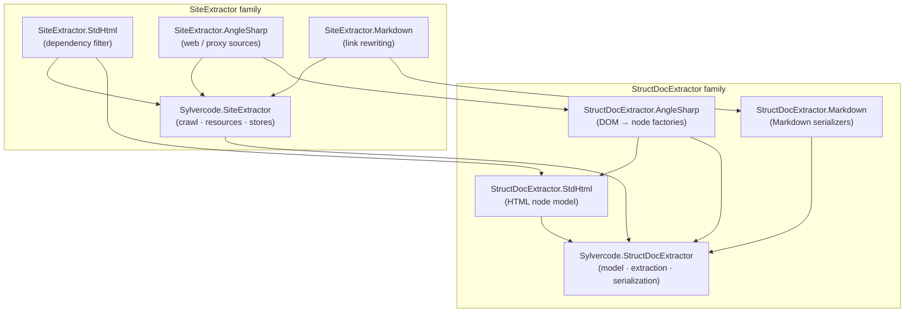
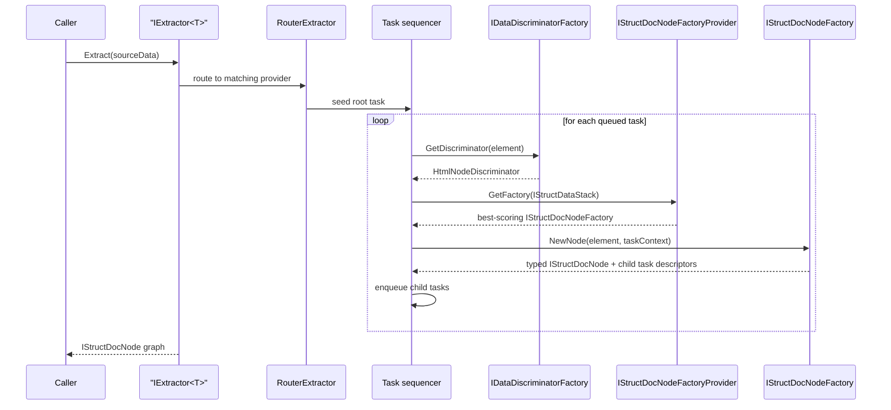
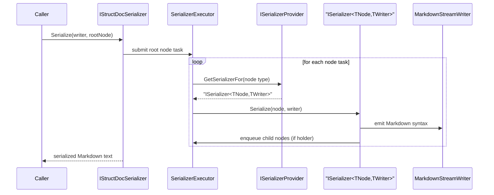
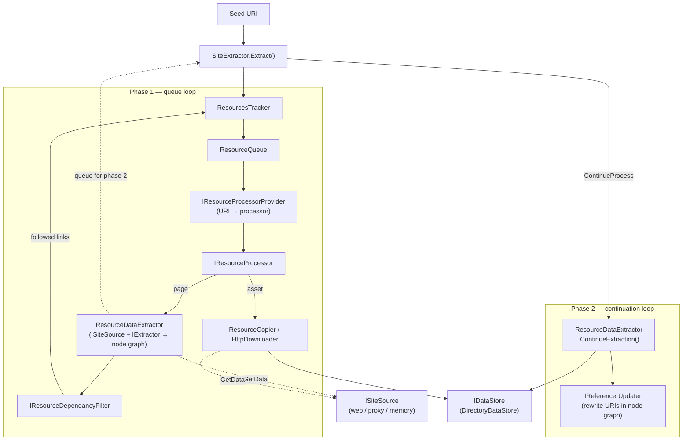

# StructDocExtractor — Architecture

StructDocExtractor is a .NET 8 framework for turning **unstructured source documents**
(typically HTML/DOM) into a **strongly‑typed structural document graph**, and then
**serializing** that graph into a target format such as Markdown. On top of that core, a
second family of packages (`SiteExtractor`) can **crawl an entire website**, following
resource dependencies, downloading assets, and rewriting links so the extracted output is
self‑contained.

This document explains the high‑level design and the main pipelines. For a hands‑on guide to
building your own extractor on top of the framework, see the [README](./README.md). A
condensed per‑namespace type reference is provided in the [Appendix](#appendix--type-reference-by-namespace).

> All examples below are **hypothetical**. Imagine you want to extract an online recipe site,
> `https://example.com`, into Markdown. We will use placeholder names such as
> `Acme.DocExtractor`, `RecipeRoot`, and `RecipeSection` throughout.

---

## 1. What the framework does

At its heart the framework performs two independent transformations:

1. **Extraction** — read some source data and build a tree of typed nodes
   (`IStructDocNode`). The tree is a *semantic* model: headings, paragraphs, lists, tables,
   links, images, and any domain‑specific node types you define.
2. **Serialization** — walk that tree and emit text in a target syntax (e.g. Markdown),
   using one serializer per node type.

`SiteExtractor` wraps these two steps in a **crawl loop**: it discovers resources, decides
which dependencies to follow, copies binary assets, and updates references between the
generated files.

A key design idea is that **which node to build is decided by *scoring*** the source
element against a stack of criteria, rather than by a hard‑coded switch. This makes the
model open for extension: you add a new factory with its own selector instead of editing the
core.

---

## 2. Package layout

The solution is split into two families — `StructDocExtractor` (document model, extraction,
serialization) and `SiteExtractor` (crawling, resource management, storage) — each with an
abstract core and pluggable integration packages.

| Package | Role |
|---|---|
| `Sylvercode.StructDocExtractor` | Core model, extraction pipeline, serialization pipeline, scoring machinery. |
| `Sylvercode.StructDocExtractor.StdHtml` | Standard HTML node types (`HtmlHeading`, `HtmlTable`, …) + `HtmlNodeDiscriminator` + score helpers. |
| `Sylvercode.StructDocExtractor.AngleSharp` | AngleSharp DOM → node factories that build `StdHtml` nodes. |
| `Sylvercode.StructDocExtractor.Markdown` | Markdown serializers + `MarkdownStreamWriter`. |
| `Sylvercode.SiteExtractor` | Crawl orchestration: resource tracking, processors, stores, URI utilities. |
| `Sylvercode.SiteExtractor.StdHtml` | HTML dependency filtering (which links to follow). |
| `Sylvercode.SiteExtractor.AngleSharp` | Live web / proxy `ISiteSource` implementations + HTTP wiring. |
| `Sylvercode.SiteExtractor.Markdown` | Post‑extraction Markdown link/URI rewriting. |

Dependencies flow **from the integrations toward the two cores**, and `SiteExtractor`
consumes `StructDocExtractor` (never the reverse).

---

## 3. Core concepts

### The node graph

Every extracted document is a tree of `IStructDocNode`:

- **`IStructDocNode`** — base contract for every node; tracks identity and parent.
- **`IStructDocNodeHolder`** — a node that owns an ordered `Content` list of child nodes.
- **`IStructDocReferencer`** — a node that carries a URI reference (links, images). Exposes
  `GetReferenceType()`, `GetReference()`, and `UpdateReference()` so the site pipeline can
  rewrite links later.
- **`MetadataDictionary` / `StdMetadata`** — key/value metadata attached to nodes (for
  example, the page's top heading, used to name output files).

Concrete base classes (`BaseStructDocNode<TParent>`, `BaseStructDocBlock<TParent,TChild>`,
`BaseStructDocRootBlock<TChild>`) encode **parent/child type constraints** so the tree is
type‑safe: a `RecipeSection` can only live under a `RecipeRoot`, and so on.

### Discriminators and score‑based routing

Rather than matching source elements by a giant switch, the framework computes a
**discriminator** for each source element (for HTML this is `HtmlNodeDiscriminator`, carrying
tag name + CSS classes). A **factory provider** keeps a stack of source context and asks each
candidate factory's **score criteria** how well it matches. The highest‑scoring factory wins
and builds the node. Scoring is composable via matchers
(`StaticValueMatcher`, `RegexValueMatcher`, `ValuesMatcherAll`/`ValuesMatcherAny`) assembled
through builders such as `HtmlScoreCriteriaSetsBuilder`.

---

## 4. Extraction pipeline

`IExtractor<TExtractionData>` is the entry point. Given source data (for HTML‑over‑AngleSharp,
`TExtractionData` is `INode`), it produces a root `IStructDocNode` and recursively builds the
tree via a task queue.

Steps:

1. The extractor seeds a task for the root source element.
2. For each task, a **discriminator** is computed from the source data
   (`IDataDiscriminatorFactory`).
3. The **factory provider** (`IStructDocNodeFactoryProvider`) selects the best‑scoring
   `IStructDocNodeFactory` using the current context stack (`IStructDataStack`).
4. The factory builds the node (attaching metadata) and declares which child source
   elements should become **child tasks**.
5. Child tasks are enqueued and processed the same way, growing the tree.

A `RouterExtractor` sits above individual providers and picks the right provider for a given
region of the document (e.g. the "table of contents" area vs. the "article body" area).

---

## 5. Serialization pipeline

`IStructDocSerializer` walks a finished node graph and writes text. Resolution is
**type‑dispatched**: `ISerializerProvider` finds the registered `ISerializer<TNode,TWriter>`
for each node's runtime type (falling back to base types).

Steps:

1. `StructDocSerializer` submits the root node to an executor
   (`StructDocSerializerExecutor`).
2. For each node, `ISerializerProvider` resolves the matching serializer.
3. The serializer writes the node's own text to a writer, then — if the node is a holder —
   recurses into its `Content`.
4. The writer (e.g. `MarkdownStreamWriter`, a `TextWriter` that understands Markdown styles
   and indentation) accumulates the final output.

Serializers are typically written by extending `BaseMarkdownSerializer<TNode>` and supplying a
handler that emits the syntax for that node type.

---

## 6. Integration layers

The three `StructDocExtractor.*` integration packages are what make the abstract core usable:

- **StdHtml** provides the *vocabulary*: concrete HTML node types (`HtmlHeading`,
  `HtmlParagraph`, `HtmlList`, `HtmlTable`, `HtmlAnchor`, `HtmlImg`, …), the
  `HtmlNodeDiscriminator`, and `HtmlScoreCriteriaSetsBuilder` for expressing selectors
  fluently.
- **AngleSharp** provides the *input adapter*: a family of factories (one per HTML element
  kind) that read AngleSharp DOM elements and emit StdHtml nodes, plus the
  `AngleSharpNodeFactoryProvider` base class and the `AddAngleExtractorFor<TProvider>()` DI
  helper.
- **Markdown** provides the *output adapter*: a serializer per node type and the
  `MarkdownStreamWriter` that renders Markdown syntax (headings, emphasis, links, tables,
  lists).

Your domain package plugs into all three: define domain node types (extending StdHtml/base
types), register AngleSharp factories for them, and register Markdown serializers for them.

---

## 7. Site extraction

`ISiteExtractor` turns single‑document extraction into a full crawl. Given a seed URI it runs
a **two‑phase loop**:

**Phase 1 — primary processing**

1. `ResourcesTracker` records the seed as a `Resource` and, via
   `IResourceProcessorProvider`, assigns it a processor (matched by URI rules).
2. Resources are queued in a `ResourceQueue`.
3. Each `IResourceProcessor` runs:
   - `ResourceDataExtractor` fetches a page via `ISiteSource`, then extracts a node graph using the core `IExtractor`, and discovers referenced URIs.
   - `ResourceCopier` / `HttpDownloader` copies binary assets (e.g. images) into the store.
4. Discovered dependencies are filtered by `IResourceDependancyFilter`
   (`HtmlResourceDependencyFilter` decides whether to follow/keep/drop each link) and, if
   followed, are added back to the tracker.

**Phase 2 — post‑processing**

Unfinished results are resumed once Phase 1's queue is drained. `ResourceDataExtractor.ContinueExtraction()` first calls `IReferencerUpdater` (e.g. `MarkdownReferencerUpdater`) to rewrite each `IStructDocReferencer` URI to the correct output file (now that all output paths are known), then serializes the node graph and writes it to `IDataStore`.

Sources are pluggable through `ISiteSource`: `AngleSharpWebSource` fetches live pages,
`AngleSharpProxySource` parses HTML delivered by another source, and `MemorySiteSource`
serves in‑memory fixtures.

---

## 8. Extension points & dependency injection

The framework is wired through `Microsoft.Extensions.DependencyInjection`. The most important
extension points and their registration helpers:

| Concern | Key type(s) | Registration helper |
|---|---|---|
| Extract nodes from AngleSharp DOM | `AngleSharpNodeFactoryProvider`, `IStructDocNodeFactory` | `AddAngleExtractorFor<TProvider>()` |
| Serialize a node type | `ISerializer<TNode,TWriter>`, `BaseMarkdownSerializer<T>` | `AddSerializer<TNode,TSerializer>()`, `AddMarkdownSerializers()` |
| Markdown site serialization | `MarkdownReferencerUpdater`, `MarkdownUriTranslater` | `AddMarkdownSerialization()` |
| Site sources | `ISiteSource` | `AddAngleSharpSiteExtractor()`, `AddAngleSharpWebSource()` |
| Resource processors | `IResourceProcessor`, `IResourceProcessorProvider` | `AddResourceProcessorProvider()`, `AddResourceDataExtractorProcessor<T>()`, `AddImageCopierProcessor()` |
| Dependency filtering | `IResourceDependancyFilter` | `AddHtmlResourceDependencyFilter()` |
| Storage | `IDataStore` | `AddDirectoryDataStore()`, `AddMemoryDataStore()` |
| URI redirects | `IUriRedirector` | `AddUriRedirector(regex, replace)` |
| Downloading | `HttpDownloader` | `AddHttpDownloader()` |

Configuration is bound through the options pattern. `SiteExtractorOptions` (bound from the
`"SiteExtractor"` section) supplies `SourceAuthority`, `SourceBasePath`, and `OutputDirectory`;
`HtmlResourceDependencyFilterOptions` and `ResourceCopierOptions` tune crawl and asset
behaviour.

---

## 9. Where to go next

- **[README.md](./README.md)** — step‑by‑step guide to building your own extractor library
  and CLI on top of this framework.
- **[Appendix](#appendix--type-reference-by-namespace)** — a condensed reference of every
  namespace and its notable types.

---

## Appendix — Type reference by namespace

This appendix is a condensed map of the framework's namespaces and their most important types.
It is organised bottom‑up (foundations first, integrations last), mirroring the dependency
order described above.

### `Sylvercode.StructDocExtractor` (core)

| Namespace | Key types | Purpose |
|---|---|---|
| `.Metadatas` | `Metadata`, `MetadataDictionary`, `StdMetadata` | Key/value metadata attached to nodes; `StdMetadata` holds well‑known keys (e.g. page top heading). |
| `.Model` | `IStructDocNode`, `IStructDocBlock`, `IStructDocNodeHolder`, `IStructDocReferencer`, `StructDocRootBlock` | Core node contracts and the root container. `IStructDocReferencer` exposes `GetReference()`/`UpdateReference()` for link rewriting. |
| `.Model.Base` | `BaseStructDocNode<TParent>`, `BaseStructDocBlock<…>`, `BaseStructDocRootBlock<…>` (+ `…WithAnyContent`/`…WithAnyParent` variants) | Abstract bases encoding parent/child type constraints and identity/metadata storage. |
| `.Model.Init` | `IStructDocNodeInitializer`, `IParentChildLinkInitializer`, `ParentChildLinkInitializer` | Wire up bi‑directional parent/child links after construction. |
| `.Model.Utils` | `ISrcNodeStack`, `SrcNodeStack` | Track source‑node context during traversal. |
| `.Extraction` | `IExtractor`, `IExtractionTask`, `IProcessTaskResult`, `IRouterExtractorSelector`, `TaskResultType`, `Extractor`, `RouterExtractor`, `ExtractorTaskSequencer(Handler)` | The extraction pipeline: entry point, task model, routing, and orchestrators. |
| `.Extraction.Factory` | `IStructDocNodeFactory`, `IStructDocNodeFactoryProvider`, `IStructDocNodeFactoryProviderStack`, `IDataDiscriminatorFactory`, `IChildrenTaskInfoFactory` | Discriminated factory routing that builds nodes from source data. |
| `.Extraction.PreviewProvider` | `IDataPreviewProvider`, `StringPreviewProvider`, `ToStringPreviewProvider` | Human‑readable previews of source data for diagnostics. |
| `.Extraction.TaskInfo` | `IChildrenTaskInfo`, `ChildrenTaskInfo`, `NodeHolderChildrenTaskInfo`, `ParentTaskInfo`, `ProxyChildrenTaskInfo`, `TaskIndex` | Descriptors that tell the sequencer how to spawn child tasks. |
| `.Serialization` | `ISerializer`, `ISerializerProvider`, `IStructDocSerializer`, `SerializerProvider`, `StructDocSerializer(Executor)`, `BaseStructDocNode(Holder)Serializer`, `ITextWriterAdapterProvider`, `StringTextWriter` | The serialization pipeline: type‑dispatched serializers and the tree walker. |
| `.Serialization` (indent) | `IndentType`, `IndentSpec`, `IndentedStreamWriter`, `IndentedSerializerHandler`, `IndentedStreamWriterProvider` | Indentation‑aware `TextWriter` decorator and handler used by output writers. |
| `.StructDataStack` | `IStructDataStack`, `BaseStructDataStack` | Stack of source context used during discriminated extraction. |
| `.StructDataStack.Score` | `IValueMatcher`, `StaticValueMatcher`, `RegexValueMatcher`, `ValuesMatcherAll`/`Any`, `NodeScoreCriteriaSet`, `NodeScore`, `StackedNodesScore`, `IStackScoreCalculator`, `StackScoreCalculator`, `BaseScoreCriteriaSetsBuilder` | The scoring machinery that selects the best‑matching factory. |

### `Sylvercode.StructDocExtractor.StdHtml`

| Namespace | Key types | Purpose |
|---|---|---|
| `.Model` | `PlainTextNode`, `HtmlHeading`, `HtmlParagraph`, `HtmlAnchor`, `HtmlImg`, `HtmlBr`, `HtmlEmphases`, `HtmlStrong`, `HtmlList(Item)`, `HtmlDiv`, `HtmlAside`, `HtmlFigure`/`HtmlFigCaption`, `HtmlTable*` (table/head/body/foot/row/cell), `HtmlNodeDiscriminator`, `HtmlExtractionStack` | Concrete HTML node vocabulary and the `HtmlNodeDiscriminator` (tag + CSS classes). |
| `.Extraction.Factory` | `IHtmlNodeFactory`, `HtmlNodeFactoryProvider` | HTML factory contract keyed on `HtmlNodeDiscriminator`. |
| `.StructDataStack.Score` | `HtmlNodeDiscriminatorExtentions`, `HtmlScoreCriteriaBuilder` (`HtmlScoreCriteriaSetsBuilder`) | Fluent helpers for building HTML score‑criteria selectors. |

### `Sylvercode.StructDocExtractor.AngleSharp`

| Namespace | Key types | Purpose |
|---|---|---|
| `.Extraction.Factory` | `BaseAngleNodeFactory`, `BaseParagraphFactory`, and one factory per HTML element (`HtmlAnchorFactory`, `HtmlHeadingFactory`, `HtmlImgFactory`, `HtmlTable*Factory`, …), `HtmlNodeDiscriminatorFactory`, `HtmlDataPreviewProvider` | Convert AngleSharp DOM elements into StdHtml nodes. |
| `.Extraction` | `AngleProcessTaskResultBuilder`, `AngleSharpExtractorExtentions` (`AddAngleExtractorFor<T>()`) | Build process‑task results and register AngleSharp extractors in DI. |
| (root) | `AngleSharpNodeFactoryProvider`, `StructDocNodeFactoryProviderSelector` | Base factory provider (scoped by CSS selector) and provider selection. |

### `Sylvercode.StructDocExtractor.Markdown`

| Namespace | Key types | Purpose |
|---|---|---|
| `.Serialization.Writer` | `MarkdownStreamWriter`, `MarkdownStreamWriterProvider`, `MarkdownStyle`, `StyleCharacter` | Markdown‑aware `TextWriter` managing inline styles and block scope. |
| `.Serialization.Base` | `BaseMarkdownSerializer<TNode>` (+ holder variant) | Abstract base for all Markdown node serializers. |
| `.Serialization` | One serializer per node type (heading, paragraph, list, table, anchor, image, emphasis, strong, plain text, …), `AddMarkdownSerializers()` | Emit Markdown syntax for each StdHtml node type. |

### `Sylvercode.SiteExtractor` (crawl core)

| Namespace | Key types | Purpose |
|---|---|---|
| `.UriUtils` | `IUriMatcher`, `IUriTranslater`, `IUriRedirector`, `ImageUriMatcher`, `UriMatcherByBase`, `UriBaseTranslater`, `RelativeUriTranslater`, `StaticDirUriTranslater`, `UriRelativeFromBaseTranslater`, `NoopUriTranslater`, `UriRedirector(Extentions)`, `UriExtentions` | URI matching, translation, and redirection helpers. |
| `.Sources` | `ISiteSource`, `ISiteSourceProvider`, `MemorySiteSource(Extensions)` | Fetch raw document content by URI; in‑memory source for tests. |
| `.Store` | `IDataStore`, `BaseDataStore`, `MemoryDataStore`, `DirectoryDataStore` (+ their `*Extensions`) | Persist extracted output to memory or disk. |
| `.Resources` | `Resource`, `ResourceState`, `ResourcePullState`, `ResourceQueue`, `ResourceRepository`, `IReadOnlyResourceRepository`, `ResourcesTracker`, `IReferencerUpdater`/`ReferencerUpdater`, `IResourceUriTranslater`/`ResourceUriTranslater` | Resource model, tracking/dedup, and reference/URI updating. |
| `.Resources.Processors` | `IResourceProcessor(Provider)`, `IResourceProcessorResult`, `IResourceCopiler`, `IResourceDataExtractor`, `IResourceDependancyFilter`, `ResourceCopier(Options)`, `ResourceDataExtractor`, `ResourceProcessorProvider`, `DataExtractedProcessorResult`, `NoPostProcessResult`, `ResourceProcessorExtentions` | Pluggable per‑resource processing (extract, copy) and processor routing. |
| `.Downloader.Http` | `HttpDownloader(Extentions)` | Download resources over HTTP into the store. |
| (root) | `ISiteExtractor`, `SiteExtractor`, `SiteExtractorOptions`, `SiteExtractorExtensions` | Top‑level two‑phase crawl orchestration and its options. |

### SiteExtractor integrations

| Package / namespace | Key types | Purpose |
|---|---|---|
| `Sylvercode.SiteExtractor.StdHtml` | `HtmlResourceDependencyFilter(Options)`, `HtmlResourceDependencyFilterMode`, `…Extensions` | Classify HTML links (stylesheet/script/image) and decide keep/remove/download. |
| `Sylvercode.SiteExtractor.Markdown` | `MarkdownUriTranslater`, `MarkdownReferencerUpdater`, `MarkdownSerializationExtentions` (`AddMarkdownSerialization()`) | Rewrite link/image URIs inside serialized Markdown after extraction. |
| `Sylvercode.SiteExtractor.AngleSharp` | `BaseAngleSharpSiteSource`, `AngleSharpWebSource`, `AngleSharpProxySource`, `AngleSharpSiteExtractorExtentions` (`AddAngleSharpSiteExtractor()`) | Live web and proxy `ISiteSource` implementations and full‑pipeline DI wiring. |
